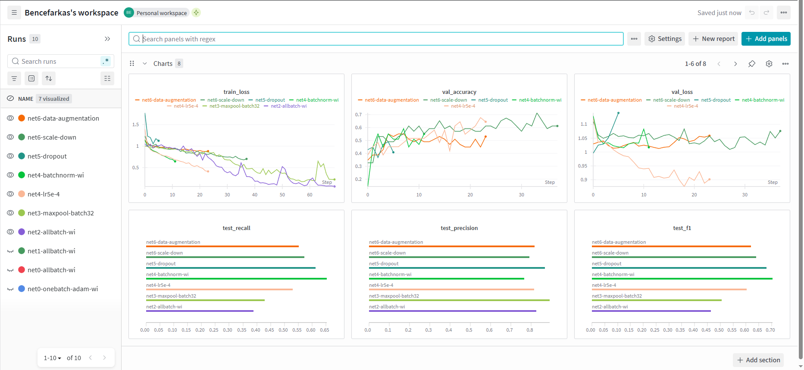
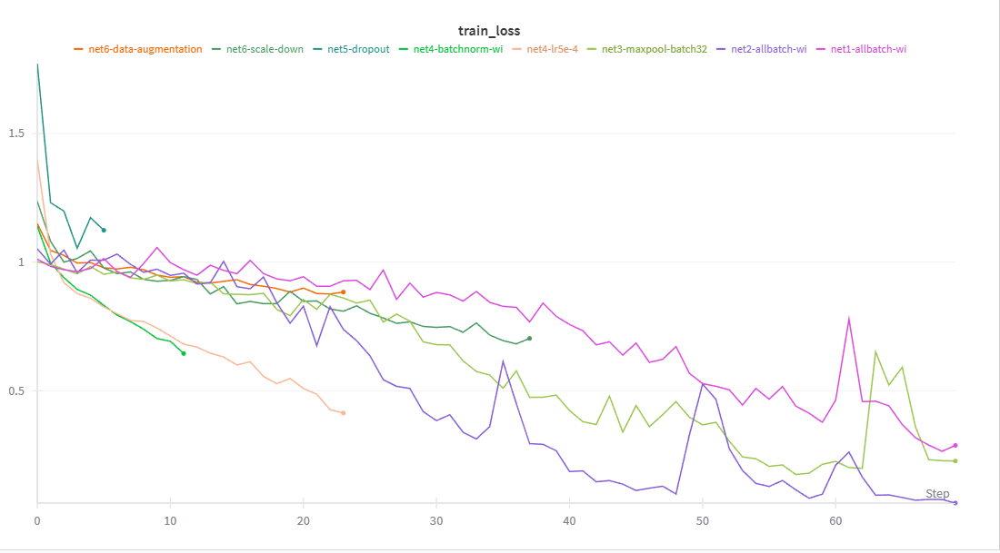

# Deep Learning Class (VITMMA19) Project Work

## Project Details

### Project Information

- **Selected Topic**: AnkleAlign
- **Student Name**: Farkas Bence
- **Aiming for +1 Mark**: Yes

### Solution Description

My approach was for the solution of this image classification problem is that first I tried to create a smallest CNN with pytorch that can overfit on one batch of image data. After this I started to increase the model's size and complexity until a point where the model overfits on training data, than started adding regularization and oder techniques to the model to lower the chance of overfit: early stopping, maxpool layers, batch normalization. Also all model used weight initialization, to be more deterministic, so one run on the same model does not stall because of a bad random initialization. On all of my models developed in this incremental way are logged on wandb during development process. I couldn't made the wandb runs shareable so I will include two screen shots here.





### Data Preparation

The run.sh script includes a wget command to download the anklealign.zip with all the data, and then unzips the data to the mounted data folder. After this the preprocessing starts with the first python script (01_data_preprocessing.py): All the images are located under folders named after participant's Neptune code, so my script moves all the images to a _preped folder under data folder, and to avoid the image name conflict the Neptune code is appended before the image name. Then a similar renaming happens inside the participant's label json file, where the LabelStudio's random hash prefix is removed and replaced with Neptune code. After this label files moved to _label folder, and the image-label mapping is carried out.

The consensus folder is a little different, because of the name conflict could not be solved with appending the Neptun codes, because the consensus label files are not containing them and we can't match the labels to images. My approach was that I checked that out of the 57 consensus images there are only 8 of them which has conflicting names, so I ignored these because I think that the remaining 49 will be sufficient for testing the model. Each remaining consensus image will be labeled by the majority label. Finally the train-test split is carried out in a way that the 49 consensus images will be the test set, and the rest of the images which could be processed and not in the consensus images will be the train set.  

### Extra Credit Justification

For developing a convolutional neural network for the 3 class classification problem, I used incremental model development. For this I created a python notebook *(inc-model-dev.ipynb)* for experimenting with the model architectures. First I was trying to create the most simple network, with only convolutional layers and fully connected layers. My smallest network is net0 with 3 conv layers. This was the model which could be overfitted on one batch of training data. For starter I used a 16 batch size, later increased to 32 for testing bigger networks. Then I created net1 and net2 with extra conv layers which can be overfitted on all the training data available. So from this point I tried to focus on restraining the model for better generalization capabilities.  Net3 is a version of net2 where the stride=2 is changed to maxpool layers to help with the overfitting problem. Also this was the first cnn where early stopping is used. In net4 I added some batch normalization and in net5 I added some dropout to the fully connected layers. After all it looked like I did overshoot the model complexity so I removed one conv layer in net6. 

I also used some random data transformation for training net6, like horizontal flip or random rotation. I logged my networks run on wandb. I noticed that net6 may be still to big, because early stopping shuts down training to early and the models performance look random after evaluation: sometimes recall and f1 score could achieve 70%, but sometimes it only achieves 40%. But decreasing model complexity further gave the results that the model could not learn the training data.

### Docker Instructions

This project is containerized using Docker. Follow the instructions below to build and run the solution.

#### Build

Run the following command in the root directory of the repository to build the Docker image:

```bash
docker build -t dl-project .
```

#### Run

To run the solution, use the following command. You must mount your local data directory to `/app/data` inside the container.

**To capture the logs for submission (required), redirect the output to a file:**

```bash
docker run --gpus all -v $(pwd)/data:/app/data dl-project > log/run.log 2>&1
```


### File Structure and Functions

The repository is structured as follows:

- **`src/`**: Contains the source code for the machine learning pipeline.
    - `01-data-preprocessing.py`: Scripts for loading, cleaning, and preprocessing the raw data.
    - `02-training.py`: The main script for defining the model and executing the training loop.
    - `03-evaluation.py`: Scripts for evaluating the trained model on test data and generating metrics.
    - `04-inference.py`: Script for running the model on new, unseen data to generate predictions.
    - `config.py`: Configuration file containing hyperparameters (e.g., epochs) and paths.
    - `utils.py`: Helper functions and utilities used across different scripts.
    - `networks.py`: Contain the definition of CNN models: one simple base CNN and the selected best CNN from incremental model development.

- **`notebook/`**: Contains Jupyter notebooks for analysis and experimentation.
    - `preprocess.ipynb`: Notebook for initial exploratory data analysis and preprocessing test.
    - `inc-model-dev.ipynb`: Notebook for creating and testing model in an incremental way, logging to wandb.ai.

- **`log/`**: Contains log files.
    - `run.log`: Example log file showing the output of a successful training run.

- **`wandb-imgs/`**: Contains two png images of my wandb runs.
    - `wandb-runs-all-metrics.png`: Image of all the metrics recorded on wandb
    - `wandb-runs-train-loss.png`: Bigger picture of only the train losses on wandb logging.
- **Root Directory**:
    - `Dockerfile`: Configuration file for building the Docker image with the necessary environment and dependencies.
    - `requirements.txt`: List of Python dependencies required for the project.
    - `README.md`: Project documentation and instructions.
